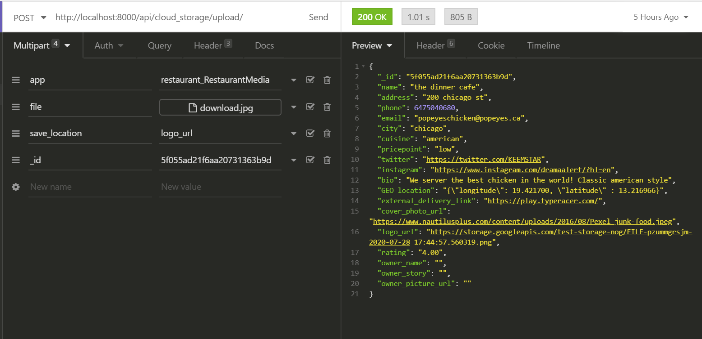

This section will go over all the backends components of the Scarborough Dining Project.

## Models & Enums

#### Auth2

###### Scarborough Dining User

```python
     nickname = models.CharField(max_length=30, blank=True, default="")
     name = models.CharField(max_length=50, default='')
     picture = models.CharField(max_length=200, default='')
     last_updated = models.CharField(max_length=200, default='')
     email = models.EmailField(primary_key=True, default='')
     email_verified = models.BooleanField(default=False)
     role = models.CharField(max_length=5, choices=Roles.choices(), default="BU")
     restaurant_id = models.CharField(max_length=24, blank=True, default=None)
```

###### Roles (Enum)

    RO = "Restaurant Owner"
    BU = "Basic User"

#### Restaurant

###### Food Item

```python
    _id = models.ObjectIdField()
    name = models.CharField(max_length=50, default='')
    restaurant_id = models.CharField(max_length=24, editable=False)
    description = models.CharField(max_length=200, blank=True, default='')
    picture = models.CharField(max_length=200, blank=True, default='')
    price = models.DecimalField(max_digits=6, decimal_places=2)
    tags = models.ListField(default=[], blank=True)
    specials = models.CharField(max_length=51, blank=True)
```

###### Manual Tag for Food Item

```python
    _id = models.ObjectIdField()
    category = models.CharField(max_length=4, choices=Categories.choices())
    value = models.CharField(max_length=50)
    foods = models.ListField(default=[], blank=True)
```

###### Restaurant

```python
    _id = models.ObjectIdField()
    name = models.CharField(max_length=30)
    address = models.CharField(max_length=60)
    phone = models.BigIntegerField(null=True)
    email = models.EmailField(unique=True)
    city = models.CharField(max_length=40)
    cuisine = models.CharField(max_length=30)
    pricepoint = models.CharField(max_length=5, choices=Prices.choices()) 
    twitter = models.CharField(max_length=200, blank=True)
    instagram = models.CharField(max_length=200, blank=True)
    bio = models.TextField(null=True)
    GEO_location = models.CharField(max_length=200)
    external_delivery_link = models.CharField(max_length=200)
    cover_photo_url = models.CharField(max_length=200,
                                       default='https://www.nautilusplus.com/content/uploads/2016/08/Pexel_junk-food.jpeg')
    logo_url = models.CharField(max_length=200,
                                default='https://d1csarkz8obe9u.cloudfront.net/posterpreviews/diner-restaurant-logo-design-template-0899ae0c7e72cded1c0abc4fe2d76ae4_screen.jpg?ts=1561476509')
    rating = models.DecimalField(max_digits=3, decimal_places=2, default=0.00)
    owner_name = models.CharField(max_length = 50, blank = True)
    owner_story = models.CharField(max_length = 3000, blank = True)
    owner_picture_url = models.CharField(max_length = 200, blank=True)
```

###### Prices (Enum)

    Low = "$"
    Medium = "$$"
    High = "$$$"

###### Categories (Enum)

    PR = "Promotion"
    FR = "Food Restriction"
    CU = "Cuisine"
    DI = "Dish"

#### Timeline

###### TimelinePost
```python
    _id = models.ObjectIdField()
    restaurant_id = models.CharField(max_length=24)
    user_email = models.EmailField()
    likes = models.ListField(default=[], blank=True)
    content = models.TextField(max_length=4096)
    Timestamp = models.DateTimeField(auto_now=True)
    comments = models.ListField(default=[], blank=True)
```

##### TimelineComment
```python
    _id = models.ObjectIdField()
    post_id = models.CharField(max_length=24)
    user_email = models.EmailField()
    likes = models.ListField(default=[], blank=True)
    content = models.TextField(max_length=256)
    Timestamp = models.DateTimeField(auto_now=True)
```


## URLs

|               Address               | Required Fields (Field Type)                                                                                                                                                       | Optional Fields                                                                    | Type | Functionality                                                |
| :---------------------------------: | :--------------------------------------------------------------------------------------------------------------------------------------------------------------------------------- | :--------------------------------------------------------------------------------- | :--: | ------------------------------------------------------------ |
|            /user/signup/            | nickname, name, picture, updated_at, email, email_verified                                                                                                                         | role (_Roles_ Name), restaurant_id                                                 | POST | Registers SDUser to DB                                       |
|           /user/role_reassign/      | user\_email, role (_Roles_ Name)                                                                                                                                                   |                                                                                    | POST | Updates Role of SDUser (Not RO)                              |
|           /user/role_reassign/      | user\_email, role (_Roles_ Name), (All Fields Needed for /restaurant/insert/)                                                                                                      |                                                                                    | POST | Updates Role of SDUSer to RO and adds his restaurant page    |
|             /user/data/             | email                                                                                                                                                                              |                                                                                    | GET  | Returns All Fields of the SDUser                             |
|            /user/exists/            | email                                                                                                                                                                              |                                                                                    | GET  | Returns if the SDUser exists in the DB                       |
|            /user/edit/              | email                                                                                                                                                                              | **nickname, name, picture, updated_at, birthday, address, phone**                  | POST | Updates the fields of the given User with the new data       |
|       /restaurant/tag/insert/       | food\_name, restaurant\_id, category (_Categories_ Name), value                                                                                                                    |                                                                                    | POST | Adds Tag to a Food Item                                      |
|       /restaurant/tag/clear/        | food_name, restaurant_id                                                                                                                                                           |                                                                                    | POST | Clears All Tags on a Food Item                               |
|        /restaurant/tag/auto/        | \_id                                                                                                                                                                               |                                                                                    | POST | Automatically tags food based on description                 |
|      /restaurant/dish/insert/       | name, restaurant_id, description, picture, price, specials                                                                                                                         |                                                                                    | POST | Adds a dish to DB                                            |
|      /restaurant/dish/get_all/      |                                                                                                                                                                                    |                                                                                    | GET  | Retrieves all dishes                                         |
|      /restaurant/dish/edit/         | \_id                                                                                                                                                                               | **name, description, picture, price, specials**                                    | POST | Updates the fields of the given Food with the new data       |
|      /restaurant/dish/delete/       | food_name, restaurant_id                                                                                                                                                           |                                                                                    | POST | Deletes dish from db                                         |
| /restaurant/dish/get_by_restaurant/ | restaurant_id                                                                                                                                                                      |                                                                                    | GET  | Retrieves all dishes from restaurant                         |
|          /restaurant/get/           | \_id                                                                                                                                                                               |                                                                                    | GET  | Retrieves Restaurant data                                    |
|        /restaurant/get_all/         |                                                                                                                                                                                    |                                                                                    | GET  | Retrieves all Restaurants                                    |
|         /restaurant/insert/         | name, address, phone, email (unique), city, cuisine, pricepoint (_Price_ Name), instagram, twitter, GEO_location, external_delivery_link, bio, cover_photo_url, logo_url, rating   | owner_name, owner_story, owner_picture_url                                         | POST | Registers a Restaurant to DB                                 |
|          /restaurant/edit/          | restaurant_id                                                                                                                                                                      | **(All Fields Needed for /restaurant/insert/ except for rating and GEO_location)** | POST | Updates the fields of the given Restaurant with the new data |
|        /timeline/post/upload/       | restaurant_id, user_email, content                                                                                                                                                 |                                                                                    | POST | Add post to timeline table                                   |
| /timeline/post/get_by_restaurant/   | restaurant_id                                                                                                                                                                      |                                                                                    | GET  | Retrieves all posts from restaurant                          |
|        /timeline/post/delete/       | post_id                                                                                                                                                                            |                                                                                    | POST | deletes a post and all linked comments from the timeline table |
|        /timeline/post/get_all/      |                                                                                                                                                                                    |                                                                                    | GET  | Retrieves all posts                                          |
|      /timeline/comment/upload/      | post_id, user_email, content                                                                                                                                                       |                                                                                    | POST | Add comment to database and to post                          |
|      /timeline/comment/delete/      | \_id                                                                                                                                                                               |                                                                                    | POST | Deletes a comment from the database                          |
|      /timeline/comment/get/         | \_id                                                                                                                                                                               |                                                                                    | GET  | Retrieves comment data                                       |
|      /order/cart/insert/            | restaurant_id, user_email                                                                                                                                                          |                                                                                    | POST | Add cart to database                                         |

All requests should be sent in a JSON format. Optional parameters can be left blank Ex: {"Role" : ""}. Bolded Fields can be omitted entirely.

## Utilities

### Seeding framework: document_seed_generator.py

#### Seeder Class: member methods

```python
    def add_randomizer(self, keyname = None, randomizerfunc = lambda x: None, gen_dict = {}):
        '''
        adds a randomly generated datatype to the JSON document being generated by Seeder
        in the format "keyname" : lambda x: faker.randomizerfunc(faker)
        if there is already a generation function in the dictionary, it will be overwritten
        Parameters:
            keyname(string):                                        the name of the JSON key
            randomizerfunc:(function(faker) -> Object(JSONEncoder))      the function responsible for randomly generating
                                                                        this key's value which must be JSON encodable
                                                                        NOTE: the randomizerfunc must take a faker as an argument
                                                                        to inject this dependency
            gen_dict({string: function(faker)}): the dictionary of functions for random generation
        Returns:
            None
        '''
    def gen_rand_dict(self, gen_dict = {}) -> 'Document':
        '''
        randomly generates one dictionary record with the current JSON in this object's gendict
        Parameters:
            seed(Primitive): data used to seed the Random.random instance of the faker
                NOTE: do not change this for any purpose other than testing, set to 0 for tests so that the outputs are identical
            gen_dict({string: function(faker)}): the dictionary of functions for random generation
        Returns:
            JSONDoc(dict): a dictionary of the format key:value generated
        '''
    def clean(self, gen_dict = {}) -> 'Cleaned Keys':
        '''
        removes the invalid random generation functions from the current generation dictionary
        Params:
            gen_dict({string: function(faker)}): the dictionary of functions for random generation
        Return:
            None
        '''
```

#### Utility functions:

    #randomly generates a restaurant name in format "{name}'s {dish}s"
    def restaurant_name_randomizer(faker, dish_dict):

    #randomly generates a phone number accounting for faker's default format
    def valid_phone_number(faker)


## API and Microservices

### Cloud-storage

Available constants 

| Constant          | Description                     |
| :---------------: | :-----------------------------: |
| TEST_BUCKET       | Path to testing bucket          |
| PRODUCTION_BUCKET | Path to deploy/production bucket|
| IMAGE             | content type for images
#### Functions

#### `upload(file, bucket_path)`
Upload file (binary data) into bucket path of our google cloud and return link to uploaded file

#### `delete(file_path)`
Check if pointed file from the file_path is a default object and if not, delete file from its bucket

#### Example

```python
from cloud_storage import cloud_controller

def test(file):
    """
    file is binary data, django forms can do this for you
    or you can use pillows
    """
    # upload file to test bucket
    path = cloud_controller.upload(file, cloud_controller.TEST_BUCKET)
    
    # optional parameter content_type, by setting it image this allows you to
    # view image in the google console instead of downloading
    #  path = cloud_controller.upload(file, cloud_controller.TEST_BUCKET, 
            #  content_type=cloud_controller.IMAGE)
    
    # delete file
    cloud_controller.delete(path)
```

#### URLS and Usage

All media uploads use the same endpoint. However the input form decides where the image is saved
(save locations are fields in mongodb model, however are listed here for convenience)

|        APP String             |     Extra parameters       |           URL             | save_locations                               |
| :---------------------------: | :------------------------: | :-----------------------: | :------------------------------------------: |
| restaurant_RestaurantMedia    | file, save_location, _id   | api/cloud_storage/upload/ | cover_photo_url, logo_url, owner_picture_url |
| restaurant_FoodMedia          | file, save_location, _id   | api/cloud_storage/upload/ | picture                                      |
  user_SDUserMedia              | file, save_location, email | api/cloud_storage/upload/ | picture                                      |
  

  