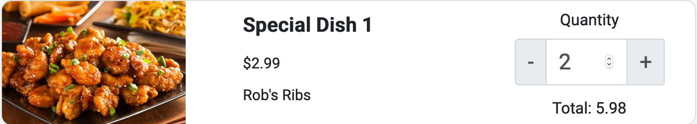

## Usage

Display order dishes for the user on the checkout page.

Files exist under `src\app\components\cart-card`

## UI Appearance



## Tag Fields

**Identifier**: `app-order-card`

### Input

Specify the input:

| Parameter | Type  | Desc         | Required |
| --------- | ----- | ------------ | -------- |
| `dish`    | `any` | Order Object | Yes      |

Currently, the dish object should contain _(Subject to Change)_:

```json
{
  "name": "{{ Dish Name }}",
  "photo": "{{ Dish Photo }}",
  "restaurant": "{{ Restaurant Name }}",
  "price": "{{ Dish Price }}",
  "quantity": "{{ Quantity }}",
  "total": "{{ Total Price of a dish }}"
}
```

Example:

```json
{
  "name": "Special Dish 1",
  "photo": "../../../assets/images/cuisines/chinese.jpg",
  "restaurant": "Rob's Ribs",
  "price": "2.99",
  "quantity": 2,
  "total": 5.98
}
```

Add this to the `.html` file. Replace the sections `{{ }}` with the input to be generated.

```html
<app-cart-card [dish]="{{ dish object }}"></app-cart-card>
```

### Output

There is no output. The card example above will be generated.
