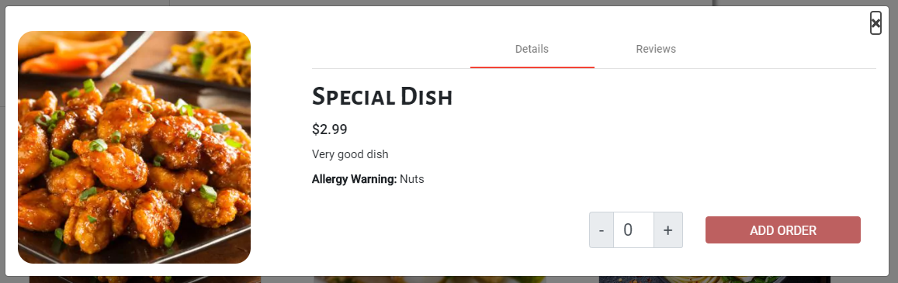
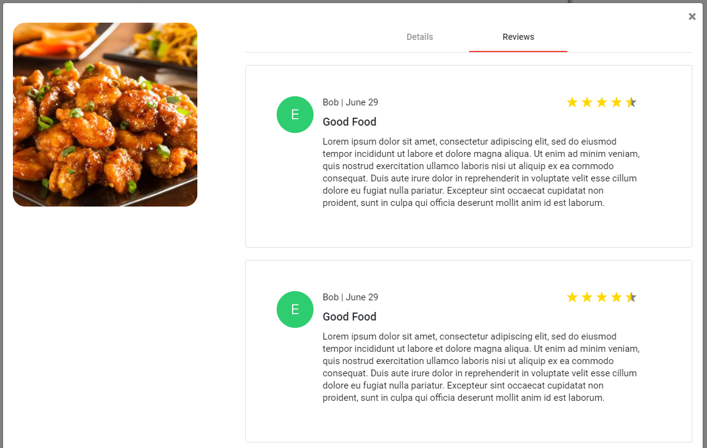

## Usage

Displaying dishes with their ratings. Clicking **View Dish** brings a modal up with dish details, ability to place orders, and dish reviews.

Files exist under `src\app\components\dish-card`

## UI Appearance





## Tag Fields

**Identifier**: `app-dish-card`

### Input

Specify the input:

| Parameter | Type  | Desc        | Required |
| --------- | ----- | ----------- | -------- |
| `dish`    | `any` | Dish object | Yes      |

Currently, the dish object should contain:

```json
{
  "type": "dish",
  "name": "{{ dish name }}",
  "rating": "{{ rating number out of 5 (whole numbers) }}",
  "price": "{{ the price of the dish }}",
  "image": "{{ path to the image file }}",
  "description": "{{ description of dish }}",
  "allergy": "{{ list of allergies }}"
}
```

Example:

```json
{
  "type": "dish",
  "name": "Special Dish",
  "rating": "4",
  "price": "2.99",
  "image": "assets/images/cuisines/chinese.png",
  "description": "Very good dish",
  "allergy": "Nuts"
}
```

Add this to the `.html` file. Replace the sections `{{ }}` with the input to be generated.

```html
<app-dish-card [dish]="{{ dish object }}"></app-dish-card>
```

### Output

There is no output yet. The card example above will be generated. When the ordering functionality is present, this component will be edited to add the correct number of the specific dish.
