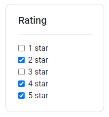

## Usage

Generating a list of filters for a category. Files exist under `src\app\components\filterlist-card`

## UI Appearance



## Tag Fields

**Identifier**: `app-filterlist-card`

### Input

Specify the input:

| Parameter       | Type       | Desc                    | Required |
| --------------- | ---------- | ----------------------- | -------- |
| `category`      | `string`   | Category of the filters | Yes      |
| `subcategories` | `string[]` | List of the filters     | Yes      |
| `length`        | `number`   | Length of subcategories | Yes      |

Add this to the `.html` file. Replace the sections `{{ }}` with the input to be generated.

```html
<app-filterlist-card
  [category]="{{ category name }}"
  [subcategories]="{{ list of subcategories }}"
  [length]="{{ length of subcategories }}"
  (events)="displayList($event)"
></app-filterlist-card>
```

Example:

```html
<app-filterlist-card
  [category]="'Rating'"
  [subcategories]="['1 star', '2 star', '3 star', '4 star', '5 star']"
  [length]="5"
  (events)="displayList($event)"
></app-filterlist-card>
```

### Output

| Return | Type        | Desc                                                                                                   |
| ------ | ----------- | ------------------------------------------------------------------------------------------------------ |
| `list` | `boolean[]` | Returns a list of boolean values with each indexes value corresponding with the list of subcategories. |

Example:
Suppose your subcategories are `['1 star', '2 star', '3 star', '4 star', '5 star']`


The returned `list` will be `[false, true, false, true, true]`, with the checked filters being `true` and unchecked `false`.

Add this to the corresponding _.ts_ file.

```javascript
displayList(list) {
    // code logic
}
```

`(events)` from the HTML code sends in the boolean list, which can now be utilized in the function.
