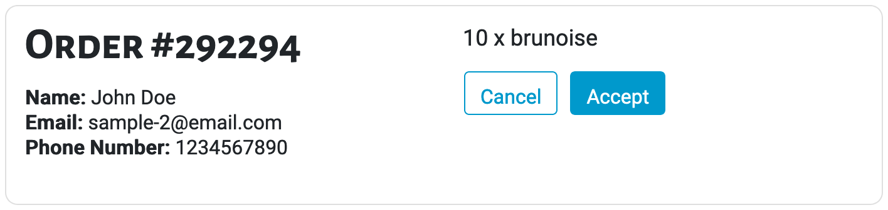
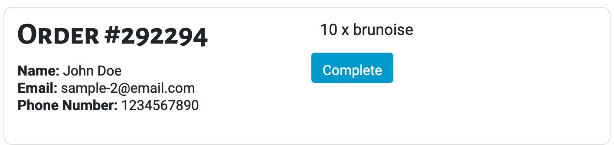

## Usage

Displaying incoming and in-progress restaurant orders from the restaurant perspective. Card automatically detects if it's a new order or in-progress order depending on it's time stamps present.

Files exist under `src\app\components\order-card`

## UI Appearance

Notice the differnce in buttons (New Order vs. In-Progress)




## Tag Fields

**Identifier**: `app-order-card`

### Input

Specify the input:

| Parameter | Type  | Desc         | Required |
| --------- | ----- | ------------ | -------- |
| `order`   | `any` | Order Object | Yes      |

Currently, the dish object should contain:

```json
{
  "id": "{{ id from MongoDB }}",
  "name": "{{ person name }}",
  "email": "{{ person email }}",
  "phone": "{{ person phone number }}",
  "price": "{{ the price of the dish }}",
  "dishes": "{{ list of objects (each object contains a dish name & quantity) }}",
  "Create_Timestamp": "{{ the time stamp for when the order was created }}",
  "AccDec_Timestamp": "{{ the time stamp for when the order was accepted }}",
  "Complete_Timestamp": "{{ the time stamp for when the order was completed }}"
}
```

Example:

```json
{
  "id": "1235",
  "name": "Jean Doe",
  "email": "sample1@email.com",
  "phone": "416-321-4567",
  "dishes": [
    {
      "name": "Fancy Dish #1",
      "quantity": 1
    },
    {
      "name": "Fancy Dish #2",
      "quantity": 2
    }
  ],
  "Create_Timestamp": "12:05:21",
  "AccDec_Timestamp": "",
  "Complete_Timestamp": ""
}
```

Add this to the `.html` file. Replace the sections `{{ }}` with the input to be generated.

```html
<app-order-card [order]="{{ order object }}"></app-order-card>
```

### Output

There is no output. The card example above will be generated.
