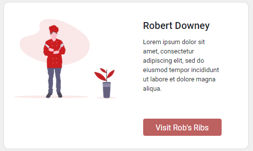

## Usage

Displaying dishes with their ratings. Files exist under `src\app\components\owner-card`

## UI Appearance



## Tag Fields

**Identifier**: `app-owner-card`

### Input

Specify the input:

| Parameter | Type  | Desc         | Required |
| --------- | ----- | ------------ | -------- |
| `story`   | `any` | Story object | Yes      |

Currently, the story object should contain:

```json
{
  "type": "story",
  "name": "{{ owner name }}",
  "profile_pic": "{{ path to image }}",
  "bio": "{{ brief biography of the owner }}",
  "restaurant": "{{ restaurant name }}",
  "_id": "{{ the mongoDB ID of the restaurant}}"
}
```

Example:

```json
{
  "type": "story",
  "name": "Robert Downey",
  "profile_pic": "assets/images/undraw_chef.png",
  "bio": "Lorem ipsum dolor sit amet, consectetur adipiscing elit, sed do eiusmod tempor incididunt ut labore et dolore magna aliqua.",
  "restaurant": "Rob's Ribs",
  "_id": "5f1e064bff72a43a3a626273"
}
```

Add this to the `.html` file. Replace the sections `{{ }}` with the input to be generated.

```html
<app-owner-card [story]="{{ story object }}"></app-owner-card>
```

### Output

There is no output. The card example above will be generated.
