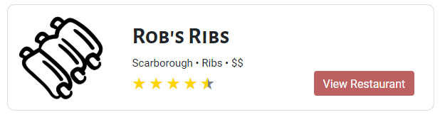

## Usage

Displaying dishes with their ratings. Files exist under `src\app\components\restaurant-card`

## UI Appearance



## Tag Fields

**Identifier**: `app-restaurant-card`

### Input

Specify the input:

| Parameter    | Type  | Desc              | Required |
| ------------ | ----- | ----------------- | -------- |
| `restaurant` | `any` | Restaurant object | Yes      |

Currently, the restaurant object should contain:

```json
{
  "name": "{{ restaurant name }}",
  "logo": "{{ url to image }}",
  "city": "{{ city restaurant is in }}",
  "cuisine": "{{ type of cuisine }}",
  "pricePoint": "{{ restaurant price point }}",
  "rating": "{{ restaurant rating }}",
  "url": "{{ url to restaurant page }}"
}
```

Example:

```json
{
  "name": "Rob's Ribs",
  "logo": "https://static.thenounproject.com/png/1939273-200.png",
  "city": "Scarborough",
  "cuisine": "Ribs",
  "pricePoint": "$$",
  "rating": "4.7",
  "url": ""
}
```

Add this to the `.html` file. Replace the sections `{{ }}` with the input to be generated.

```html
<app-restaurant-card [restaurant]="{{ restaurant }}"></app-restaurant-card>
```

### Output

There is no output. The card example above will be generated.
