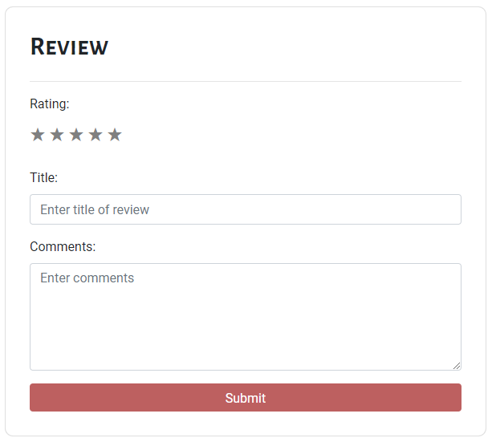

## Usage

Allows users to enter and submit a review. Returns a JSON object.

Files exist under `src\app\components\review-card`

## UI Appearance



## Tag Fields

**Identifier**: `app-review-card`

### Input

Specify the input:

| Parameter | Type     | Desc                                  | Required |
| --------- | -------- | ------------------------------------- | -------- |
| `width`   | `number` | Width of the card. Default is `500px` | No       |

Add this to the `.html` file. Replace the sections `{{ }}` with the input to be generated.

```html
<app-review-card
  [width]="{{ optional width for the card }}"
  (review)="displayReview($event)"
></app-review-card>
```

Example:

```html
<app-review-card
  [width]="600"
  (review)="displayReview($event)"
></app-review-card>
```

### Output

| Return   | Type   | Desc                              |
| -------- | ------ | --------------------------------- |
| `review` | `JSON` | Returns the review in JSON format |

When _submit_ is pressed on the card, the review data is returned in JSON format. The data is cleared from the UI once _submit_ is pressed.

```json
{
  "content": "One of the best I have eaten!",
  "rating": 5,
  "title": "Good dish"
}
```

To access the returned data, add this to the corresponding _.ts_ file. `review` is the object containing the data in JSON format.

```javascript
displayReview(review) {
    console.log(review);
}
```
