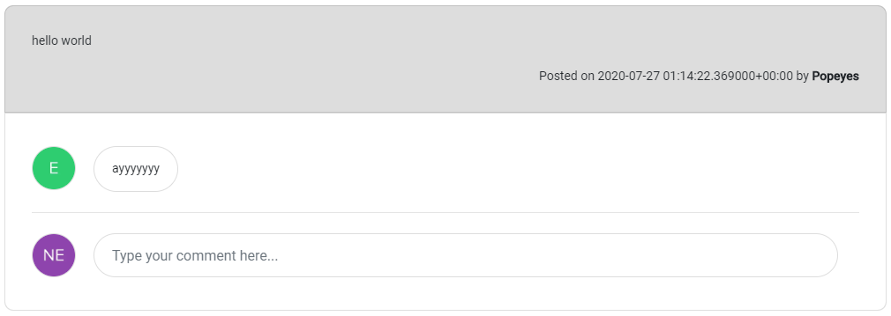

## Usage

Allows users to view and comment on a post in the timeline.

Files exist under `src\app\components\timeline-post`

## UI Appearance



## Tag Fields

**Identifier**: `app-timeline-post`

### Input

Specify the input:

| Parameter | Type     | Desc                                                | Required |
| --------- | -------- | --------------------------------------------------- | -------- |
| `post`    | `any`    | Post object from the database                       | Yes      |
| `role`    | `string` | Role of the current user. Passed using query params | Yes      |
| `id`      | `string` | Current user email (to get images and make posts)   | Yes      |

Add this to the `.html` file. Replace the sections `{{ }}` with the input to be generated.

```html
<app-timeline-post
  [post]="{{ post object }}"
  [role]="{{ user role }}"
  [id]="{{ logged in user email }}"
></app-timeline-post>
```

Example:

```html
<app-timeline-post
  [post]="post"
  [role]="role"
  [id]="userId"
></app-timeline-post>
```

### Output

There is no output. The card example above will be generated.

## Functionality

The timeline post card doubles as a comment inputter for the specific post.
