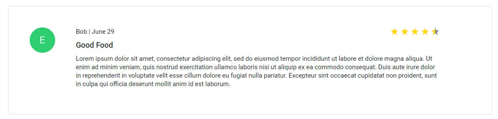

## Usage

Displays reviews.

Files exist under `src\app\components\view-review-card`

## UI Appearance



## Tag Fields

**Identifier**: `app-view-review-card`

### Input

Specify the input:

| Parameter | Type  | Desc            | Required |
| --------- | ----- | --------------- | -------- |
| `review`  | `any` | A review object | Yes      |

Currently, the review object should contain:

```json
{
  "reviewer": "{{ The name of the reviwer }}",
  "Timestamp": "{{ date the review was posted }}}",
  "reviewer_image": "{{ url to user image, provided by Auth0 and the profile page }}",
  "rating": "{{ review rating }}",
  "title": "{{ review title }}",
  "review": "{{ review content }}"
}
```

Example:

```json
{
  "reviewer": "Bob",
  "Timestamp": "2020-08-08T02:22:29.292+00:00",
  "image_path": "https://s.gravatar.com/avatar/9da1ee3c0b16457286e3e73a67c35201?s=480&r=pg&d=https%3A%2F%2Fcdn.auth0.com%2Favatars%2Fsa.png",
  "rating": 4,
  "title": "Good Food",
  "review": "It's really good"
}
```

Add this to the `.html` file. Replace the sections `{{ }}` with the input to be generated.

```html
<app-view-review-card [review]="{{ review object }}"></app-view-review-card>
```

Example:

```html
<app-review-card
  [width]="600"
  (review)="displayReview($event)"
></app-review-card>
```

### Output

There is no output. The card example above will be generated.
